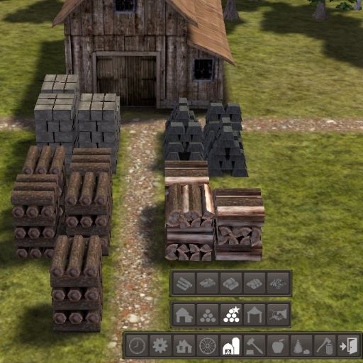

# Specialized Stockpiles

This mod adds specialized stockpiles that store a single type of resource: logs, firewood, stone, iron or coal. These stockpiles are not restricted to the 2x2 minimum size, and can be as small as 1x1.

Specialized Stockpiles is also a component of mods such as [Colonial Charter](http://blackliquidsoftware.com/index.php?/files/file/158-journey-for-banished-107/) and [The North](http://www.banishedventures.com/north/).

Note: using this with coal-altering mods such *Stop Burning the Coal* or *No Coal in Houses* causes coal to be placed in either the wood or iron stockpiles.

## Downloading
You can download the mod at the following locations:

* [Steam Workshop](https://steamcommunity.com/sharedfiles/filedetails/?id=324119513)
* [BanishedInfo](http://banishedinfo.com/mods/view/67-Specialized-Stockpiles)

## Build Commands
(From the root modkit directory, with SpecializedStockpiles as a sub-directory)

### Testing
    bin\x64\Application-x64-profile.exe /pathres ../SpecializedStockpiles/resources /ref SpecializedStockpilesResources.rsc /pathdat ../SpecializedStockpiles/bin

### Building
    bin\x64\Tools-x64.exe /pathres ../SpecializedStockpiles/resources /build SpecializedStockpilesResources.rsc /pathdat ../SpecializedStockpiles/bin

### Packaging
    bin\x64\Tools-x64.exe /pathres ../SpecializedStockpiles/resources /mod Package.rsc:SpecializedStockpiles /pathdat ../SpecializedStockpiles/bin
